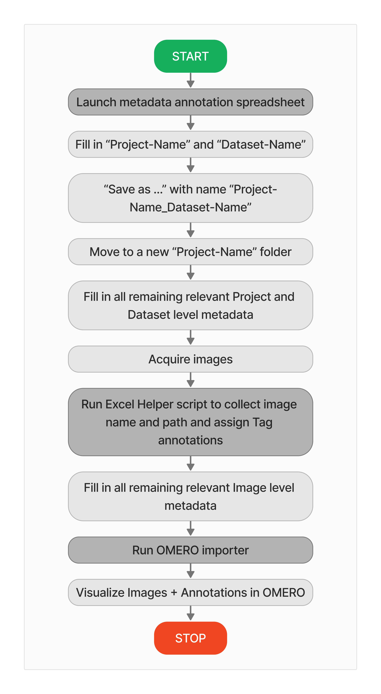

===================================================================
Welcome to the OMERO metadata annotation and image import tool set!
===================================================================

This page hosts the documentation for:

1. `OMERO Importer Python <https://github.com/WU-BIMAC/W-IDM_OmeroImporterPy>`_ tool
2. `REMBI <https://doi.org/10.1038/s41592-021-01166-8>`_-compatible metadata annotation Excel spreadsheets
3. `OMERO Importer Excel Helper Python <https://github.com/WU-BIMAC/W-IDM_OmeroImporterExcelHelperPy>`_ tool

The **OMERO Importer Python** tool was built by Alex Rigano in the Strambio-De-Castillia laboratory UMass Chan Medical School.
It automatically adds metadata annotations to bioimage data and imports Images and metadata to OMERO.

The :doc:`usage` **reads metadata** that has been entered into a :doc:`usage2` with the help of the :doc:`usage3` and uses to annotate images it imports into OMERO.

If you want to use these tools check out the :doc:`installation` section.

.. note::

   This project is under active development.

Contents
--------

.. toctree::

   intro
   usage
   usage2
   usage3
   installation
